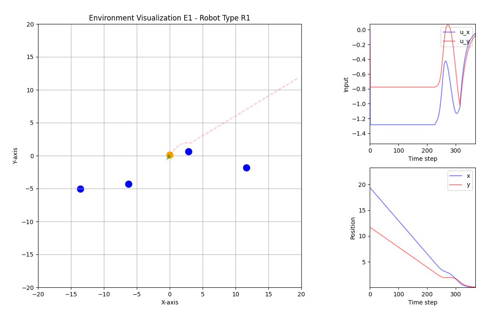
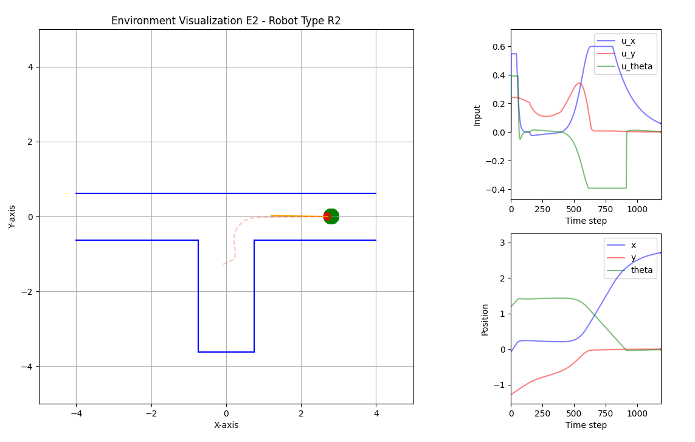
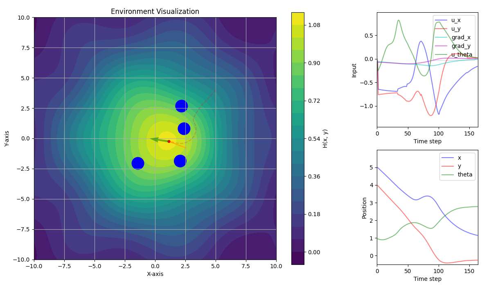

# Robot simulations

This project is a simulation of robot movement and obstacle avoidance separated in two exercises.

## Table of Contents

- [Introduction](#introduction)
- [Installation](#installation)
- [Usage](#usage)

## Introduction

This simulates several environments and robots. There are two kinds of robots:

- Omni-directional robot R1: circular footprint of 1m in diameter. $(x,y)$ kinematic model and direct inputs $(u_x,u_y)$.
- Stick-robot R2: length of 1.5m. $(x,y,\theta)$ kinematic model where $(x,y)$ is the position of the tip and $\theta$ is the orientation with respect to the x-axis. Direct inputs $(u_x,u_y,u_{\theta})$.

### Exercise 1

This exercise has two different environments. In the first environment (E1), the robot is randomly positioned and a given number of circular obstacles are randomly generated. The goal is to navigate the robot back to the origin (0,0) while avoiding collision. This can be seen in the following figure:



The second environment consist of a T-junction and the goal is to reach the randomly generated goal avoiding collision with the walls as can be seen in the following figure:



### Exercise 2

This exercises uses the exact same environment 1 (E1) as exercise 1. The difference is that now the goal is hidden and gives off a concentration given by the function:

$H(x,y) = e^{\frac{-\left(x^2+y^2\right)}{2\sigma^2}} + 0.1e^{\frac{-2((x-2)^2+(y+1)^2)}{\sigma^2}} + 0.05 \sin(0.7x) \cos(0.7y)$

Based only on local measurements of $\nabla H$, we need to guide the robot to the goal (maximum of H) while avoiding collision with obstacles. An example of this environment is given in the following figure:





## Installation

1. First clone the repository

```bash
git clone https://github.com/Lucas-Pardo/Robotic-simulations.git
```

2. Enter the repository and install requirements

```bash
cd Robotic-simulations
pip install -r requirements.txt
```

## Usage

### Exercise 1

Example usage:

```bash
python.exe exercise1.py -e 1 -r 1 -o 10 -l 20 
```

Command description:

```bash
usage: exercise1.py [-h] [--environment_type {1,2}] [--robot_type {1,2}] [--obstacle_number OBSTACLE_NUMBER] [--env_limit ENV_LIMIT]

Simulate robot movement in different environments.

options:
  -h, --help            show this help message and exit
  --environment_type {1,2}, -e {1,2}
                        Type of environment (1 or 2).
  --robot_type {1,2}, -r {1,2}
                        Type of robot (1 or 2).
  --obstacle_number OBSTACLE_NUMBER, -o OBSTACLE_NUMBER
                        Number of obstacles in the environment.
  --env_limit ENV_LIMIT, -l ENV_LIMIT
                        Limit of the environment.
```

### Exercise 2

Example usage:

```bash
python.exe exercise2.py -r 1 -o 10 -l 20 -s 5
```

Command description:

```bash
usage: exercise2.py [-h] [--robot_type {1,2}] [--env_limit ENV_LIMIT] [--obstacle_number OBSTACLE_NUMBER] [--sigma SIGMA]

Simulate robot movement in a gradient-based environment.

options:
  -h, --help            show this help message and exit
  --robot_type {1,2}, -r {1,2}
                        Type of robot (1 or 2).
  --env_limit ENV_LIMIT, -l ENV_LIMIT
                        Limit of the environment.
  --obstacle_number OBSTACLE_NUMBER, -o OBSTACLE_NUMBER
                        Number of obstacles in the environment.
  --sigma SIGMA, -s SIGMA
                        Sigma value for the environment.
```